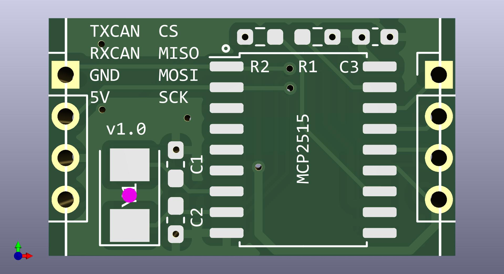
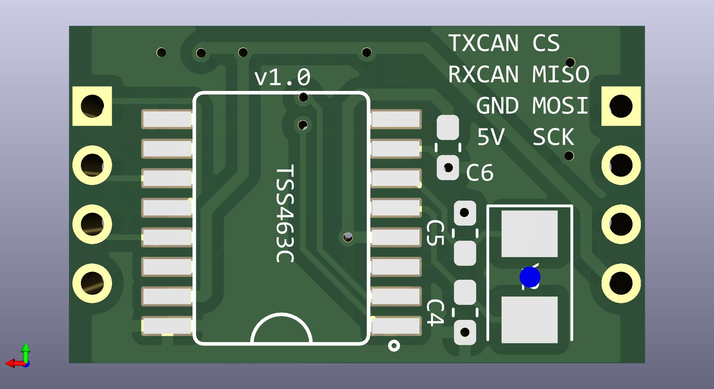

# VAN CAN SPI Shield

### What is it ?
This is an SPI "shield" designed for my [PSA VAN-CAN protocol bridge hardware][psavancanbridgehw].

On one side, it has an MCP2515 CAN bus controller, and on the other side, it has a TSS463C VAN bus controller. Both sides contain all the necessary components. Obviously only one side can be used at a time. 

It was designed using KiCad 7.0.6

### BOM

|Designator|Value         |Package                                         |
|----------|------------|------------------------------------------------|
|Y1, Y2        |8 MHz      |Crystal_SMD_5032-2Pin_5.0x3.2mm|
|C1, C2, C4, C5        |22pF      |0603|
|C3, C6        |100nF      |0603|
|R1, R2        |10K       |0603|
|MCP2515       |       |SOIC-18W_7.5x11.6mm_P1.27mm|
|TSS463C       |       |SO16L|

[psavancanbridgehw]: https://github.com/morcibacsi/PSAVanCanBridgeHW
